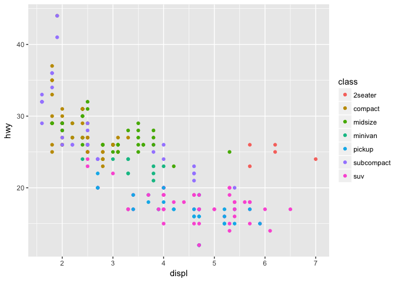

<!-- README.md is generated from README.Rmd. Please edit that file -->
ggplot2 
============================================

[](https://travis-ci.org/tidyverse/ggplot2) [](https://ci.appveyor.com/project/tidyverse/ggplot2) [](https://codecov.io/github/tidyverse/ggplot2?branch=master) [](https://cran.r-project.org/package=ggplot2)

Overview
--------

ggplot2 is a system for declaratively creating graphics, based on [The Grammar of Graphics](http://amzn.to/2ef1eWp). You provide the data, tell ggplot2 how to map variables to aesthetics, what graphical primitives to use, and it takes care of the details.

Installation
------------

``` r
# The easiest way to get ggplot2 is to install the whole tidyverse:
install.packages("tidyverse")

# Alternatively, install just ggplot2:
install.packages("ggplot2")

# Or the the development version from GitHub:
# install.packages("devtools")
devtools::install_github("tidyverse/ggplot2")
```

Usage
-----

It's hard to succinctly describe how ggplot2 works because it embodies a deep philosophy of visualisation. However, in most cases you start with `ggplot()`, supply a dataset and aesthetic mapping (with `aes()`). You then add on layers (like `geom_point()` or `geom_histogram()`), scales (like `scale_colour_brewer()`), faceting specifications (like `facet_wrap()`) and coordinate systems (like `coord_flip()`).

``` r
library(ggplot2)

ggplot(mpg, aes(displ, hwy, colour = class)) + 
  geom_point()
```



As well as the components built-in to ggplot2, there are many packages that provide extensions. See a comphrensive list at <https://www.ggplot2-exts.org>.

Learning ggplot2
----------------

If you are new to ggplot2 you are better off starting with a systematic introduction, rather than trying to learn from reading individual documentation pages. Currently, there are three good places to start:

1.  The [data visualisation](http://r4ds.had.co.nz/data-visualisation.html) and [graphics for communication](http://r4ds.had.co.nz/graphics-for-communication.html) chapters in [R for data science](http://r4ds.had.co.nz). R for data science is designed to give you a comprehensive introduction to the [tidyverse](http://tidyverse.org), and these two chapters will you get up to speed with the essentials of ggplot2 as quickly as possible.

2.  If you'd like to take an interactive online course, try [Data visualisation with ggplot2](https://www.datacamp.com/courses/data-visualization-with-ggplot2-1) by Rick Scavetta on datacamp.

3.  If you want to dive into making common graphics as quickly as possible, I recommend [The R Graphics Cookbook](http://amzn.to/2dVfMfn) by Winston Chang. It provides a set of recipes to solve common graphics problems. A 2nd edition is due out in 2017.

If you've mastered the basics and want to learn more, read [ggplot2: Elegant Graphics for Data Analysis](http://amzn.to/2fncG50). It describes the theoretical underpinnings of ggplot2 and shows you how all the pieces fit together. This book helps you understand the theory that underpins ggplot2, and will help you create new types of graphic specifically tailored to your needs. The book is not available for free, but you can find the complete source for the book at <https://github.com/hadley/ggplot2-book>.

Getting help
------------

There are two main places to get help with ggplot2:

1.  The [ggplot2 mailing list](https://groups.google.com/forum/?fromgroups#!forum/ggplot2) is a friendly place to ask any questions about ggplot2. You must be a member to post messages, but anyone can read the archived discussions.

2.  [stackoverflow](so) is a great source of answers to common ggplot2 questions. It is also a great place to get help, once you have created a reproducible example that illustrates your problem.
