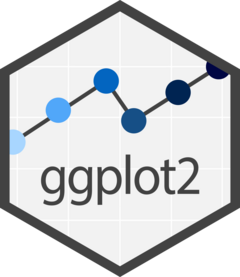
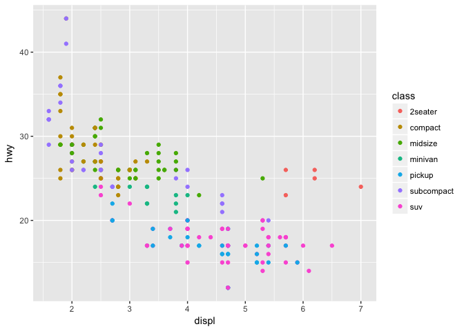

<!-- README.md is generated from README.Rmd. Please edit that file -->

# ggplot2 <a href="https://ggplot2.tidyverse.org"></a>

<!-- badges: start -->

[](https://github.com/tidyverse/ggplot2/actions/workflows/R-CMD-check.yaml)
[](https://app.codecov.io/gh/tidyverse/ggplot2?branch=main)
[](https://cran.r-project.org/package=ggplot2)
<!-- badges: end -->

## Overview

ggplot2 is a system for declaratively creating graphics, based on [The
Grammar of
Graphics](https://www.amazon.com/Grammar-Graphics-Statistics-Computing/dp/0387245448/ref=as_li_ss_tl).
You provide the data, tell ggplot2 how to map variables to aesthetics,
what graphical primitives to use, and it takes care of the details.

## Installation

``` r
# The easiest way to get ggplot2 is to install the whole tidyverse:
install.packages("tidyverse")

# Alternatively, install just ggplot2:
install.packages("ggplot2")

# Or the development version from GitHub:
# install.packages("pak")
pak::pak("tidyverse/ggplot2")
```

## Cheatsheet

<a href="https://github.com/rstudio/cheatsheets/blob/master/data-visualization.pdf"></a>

## Usage

It’s hard to succinctly describe how ggplot2 works because it embodies a
deep philosophy of visualisation. However, in most cases you start with
`ggplot()`, supply a dataset and aesthetic mapping (with `aes()`). You
then add on layers (like `geom_point()` or `geom_histogram()`), scales
(like `scale_colour_brewer()`), faceting specifications (like
`facet_wrap()`) and coordinate systems (like `coord_flip()`).

``` r
library(ggplot2)

ggplot(mpg, aes(displ, hwy, colour = class)) + 
  geom_point()
```



## Lifecycle

[](https://lifecycle.r-lib.org/articles/stages.html)

ggplot2 is now over 10 years old and is used by hundreds of thousands of
people to make millions of plots. That means, by-and-large, ggplot2
itself changes relatively little. When we do make changes, they will be
generally to add new functions or arguments rather than changing the
behaviour of existing functions, and if we do make changes to existing
behaviour we will do them for compelling reasons.

If you are looking for innovation, look to ggplot2’s rich ecosystem of
extensions. See a community maintained list at
<https://exts.ggplot2.tidyverse.org/gallery/>.

## Learning ggplot2

If you are new to ggplot2 you are better off starting with a systematic
introduction, rather than trying to learn from reading individual
documentation pages. Currently, there are three good places to start:

1.  The [Data Visualization](https://r4ds.hadley.nz/data-visualize) and
    [Communication](https://r4ds.hadley.nz/communication) chapters in [R
    for Data Science](https://r4ds.hadley.nz). R for Data Science is
    designed to give you a comprehensive introduction to the
    [tidyverse](https://www.tidyverse.org), and these two chapters will
    get you up to speed with the essentials of ggplot2 as quickly as
    possible.

2.  If you’d like to take an online course, try [Data Visualization in R
    With
    ggplot2](https://learning.oreilly.com/videos/data-visualization-in/9781491963661/)
    by Kara Woo.

3.  If you’d like to follow a webinar, try [Plotting Anything with
    ggplot2](https://youtu.be/h29g21z0a68) by Thomas Lin Pedersen.

4.  If you want to dive into making common graphics as quickly as
    possible, I recommend [The R Graphics
    Cookbook](https://r-graphics.org) by Winston Chang. It provides a
    set of recipes to solve common graphics problems.

If you’ve mastered the basics and want to learn more, read [ggplot2:
Elegant Graphics for Data Analysis](https://ggplot2-book.org). It
describes the theoretical underpinnings of ggplot2 and shows you how all
the pieces fit together. This book helps you understand the theory that
underpins ggplot2, and will help you create new types of graphics
specifically tailored to your needs.

## Getting help

There are two main places to get help with ggplot2:

1.  The [RStudio community](https://forum.posit.co/) is a friendly place
    to ask any questions about ggplot2.

2.  [Stack
    Overflow](https://stackoverflow.com/questions/tagged/ggplot2?sort=frequent&pageSize=50)
    is a great source of answers to common ggplot2 questions. It is also
    a great place to get help, once you have created a reproducible
    example that illustrates your problem.
